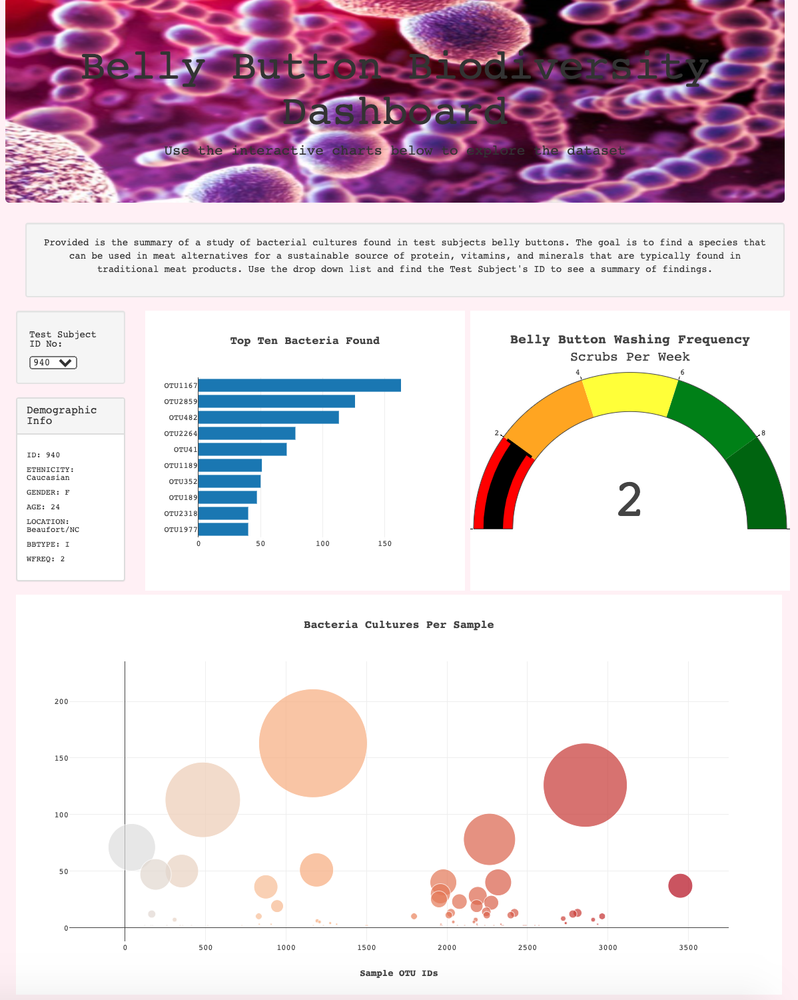

# Belly Button Bacteria
A data visualization of the result of a study to determine if subjects had a specific type of bacteria found naturally occurring in their navel to be used as a key ingredient for imitation beef.

Language: JavaScript 
Imported Libraries: Plotly, D3.js

Webpage: https://raquely44.github.io/BellyButton_Biodiversity/

First, a horizonal bar chart was created to display the top 10 bacterial species (OTUs) when an individual’s ID is selected from the dropdown menu on the web page. The sample_values, otu_ids,  otu_labels are displayed. 

Next, a gauge chart is displayed to the right of the horizonal bar chart. It updates to show the weekly washing frequency’s value which is between 0-10.

Lastly, a bubble chart is displayed toward the bottom of the page. The bubble’s size correlates to the amount of the type of bacteria found in the sample.

